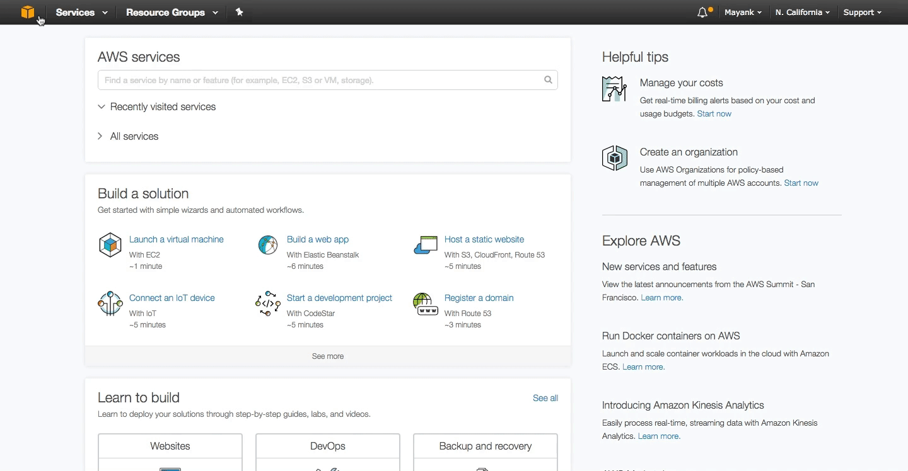
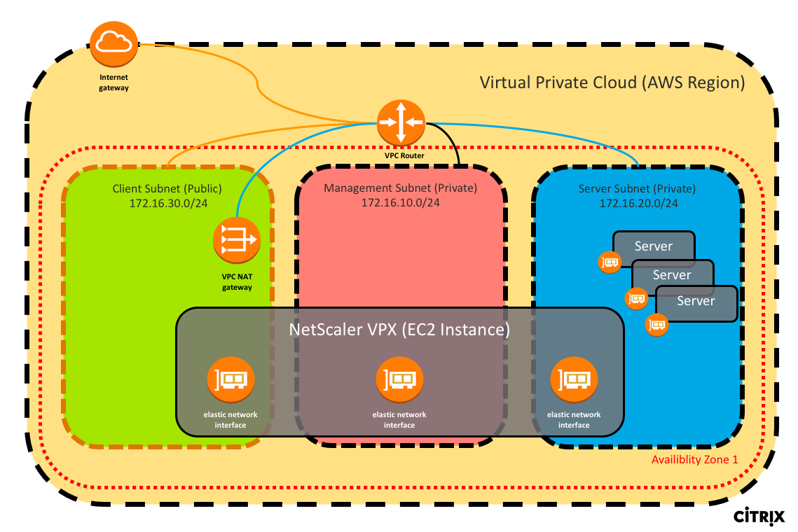

# [Compute in AWS (EC2)](#EC2) #

In this Section we will explore how to launch compute resources in AWS. If you have not already done so, login to [https://consle.aws.amazon.com](https://consol.aws.amazon.com) to gain access to the AWS dashboard. Once you have logged in, near the top left you will notice a "Service" drop down which lists all of your services available that you can subscribe to and consume for your cloud infrastructure. For configuring our cloud's computer resources, we will primarily be working in the EC2 dashboard. Click on EC2 under services to enter the [EC2 dashboard](https://console.aws.amazon.com/ec2/). 

Once you're in the [EC2 dashboard](https://console.aws.amazon.com/ec2/), you will notice in the top right my selected region is *N. California*. This designates where my resources in the cloud will be geographically residing. Each Region consists of multiple Availability Zones for high availability to mitigate your failure domain. You can view how many and which availability zones are available for given regions on AWS' website within the EC2 dashboard. In this tutorial, we will be concerning ourselves with 1 region and 1 availability zone to deploy all our compute resources  on the pre-provisioned networking infrastructure we configured in the prior [VPC tutorial](../VPC/)

##  [Overview](#EC2-Overview) ##
Before we begin, I want to outline our objectives in this tutorial. In this tutorial we will launch 2 virtual machines which are also known as [EC2 instances](https://aws.amazon.com/ec2/details/) in AWS:
  
  1. A [Windows 2016 Server EC2 instance](https://aws.amazon.com/marketplace/pp/B01M7SJEU7?ref=cns_srchrow) on the Client Subnet
  2. A [Linux Ubuntu EC2 Instance](https://aws.amazon.com/marketplace/pp/B01JBL2M0O?qid=1493848518901&sr=0-1&ref_=srh_res_product_title) on the Server Subnet

We will also configure a static public IP aka [Elastic IPs (EIP)](http://docs.aws.amazon.com/AWSEC2/latest/UserGuide/elastic-ip-addresses-eip.html) to the Windows EC2 instance for external RDP access and then use the Windows machine to SSH via Putty into the Linux EC2 instance to set up docker and a few websites.

## [Directions](/Windows-EC2/README.md#EC2-Windows) ##
1. Fist we will begin by launching our first [Windows Server 2016 EC2 Instance](Windows-EC2/README.md#EC2-Windows). Click on the link to begin this module.

2. Next we will provision a [Ubuntu 16.04 LTS EC2 Instance](Ubuntu-EC2/README.md#Linux-EC2). Click on the link to begin this module.

3. Finally we will deploy a [NetScaler VPX 10 Instance](Deploy-NS/README.md). Click on the link to begin this module.

## [Summary](#EC2-Summary) ##

After completing the modules above, you should have successfully deployed a Windows 2016 Server as a bastion host to RDP into the VPC for direct SSH access to the backed Ubuntu server which is hosting 2 websites powered by docker. Below is a summary of the final network topology you can expect to have deployed after successfully completing the three module above. 

	
 

