# [Launch a Linux EC2 Instance (Server Subnet)](#Linux-EC2) #

So far you should have deployed a [Windows 2016 EC2 instance](../Windows-EC2/README.MD) that we can RDP into. However for hosted services, backend servers are often Linux based compute servers. In this section we will deploy a Linux Instance on a private subnet that has  outbound access to the internet for updates and apt-packages but no direct access for clients from the internet. We will use the Windows Machine as a [bastion host](https://aws.amazon.com/blogs/security/controlling-network-access-to-ec2-instances-using-a-bastion-server/) to SSH into this instance and configure some web hosted services that we can access only within our Virtual Private Network. Later when we [deploy NetScaler ADC](../Deploy-NS/README.md), we will set up external access in a private back-end subnet via our NetScaler reverse proxy.

Lets begin by launching an Ubuntu instance, similar to how we did for our Windows 2016 server. 

Click on *"Launch Instances"* under *Create Instance* heading within the [EC2 dashboard](https://console.aws.amazon.com/ec2/). Next continue to configure the launch wizard. 


## 1. Select Ubuntu Server 16.04 LTS AMI from AWS Market place under Quick Start ##


  * [AWS Market](https://aws.amazon.com/marketplace/) place holds all publicly available AMI or EC2 templates that you can provision
  * Quick start ones are commonly used AMI's
  * Under *AWS Market Place* you an browse through all the official AMI's available by various Vendors. Here you will find Citrix [NetScaler AMI](https://aws.amazon.com/marketplace/pp/B00AA01BOE?ref=cns_srchrow) as we will see in the next module.
  * You can also browse through community AMI's as well as publish your own AMI's created from EC2 instances into the community store. For [example](https://github.com/cargomedia/vagrant-boxes), this is a Debian based AMI (ami-01220416) for [Vagrant environments](https://www.vagrantup.com/) available in the community store. 

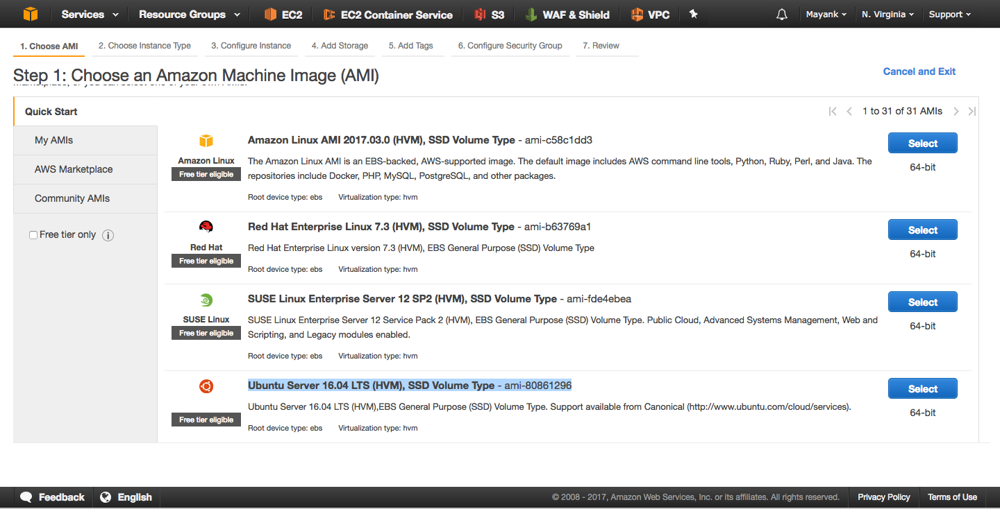

## 2. Next under Instance Type select ***t2.micro*** ** which is [Free Tier Elegible](https://aws.amazon.com/s/dm/optimization/server-side-test/free-tier/free_nc/#details) ##
	* In this step of the Wizard you can select various different resource allocations to your EC2 instance. **Note** that pricing varies based on size of the instance. 
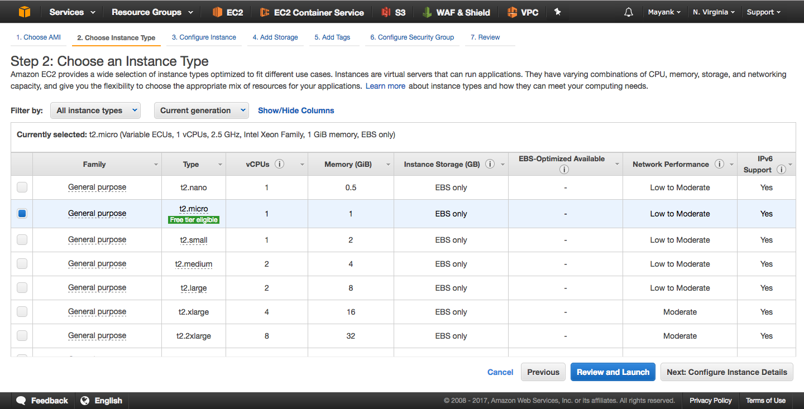

## 3. Next under Configure Instance Details you will specify networking and other configurations ##

* **Number of Instances** will allow you to provision multiple simultaneously.
  > Enter **1** for single instance
  
* **Purchasing option** gives you the opportunity to bid on an instance and provision [spot instances](https://docs.aws.amazon.com/AWSEC2/latest/UserGuide/using-spot-instances.html?icmpid=docs_ec2_console) to reduce compute costs with the trade of flexible around when your applications run and if your applications can be interrupted. 	  
  > Uncheck Spot Instance
  
* **Network** defines which VPC your EC2 will reside in. This binds the EC2 to the networks associated in your virtual private cloud
  > Select the [Demo-VPC](../VPC/README.MD#VPC)** we created in the VPC module.
  
* **Subnet** chooses which network your EC2 will reside in. Here is what determines what IP space the Instance will obtain an IP in as well as the routes it has available to route traffic with the subnet's associated Route Table.
   > Select the **[Server Subnet](../VPC/README.MD#Server-Subnet)** to provision this instance to.
	 
* **Auto-assign Public IP** applicable for public subnets with a default route through the Internet Gateway allows instances to be accessed directly with public IPs which are ephemeral. These public IP's are associated dynamically with the instance only during up time of the instance. These IP's are released into a pool when the instance is turned off and a new one is associated upon reboot. These Public IP's are **NOT** static. 
  > Select Disable given this instance is provisioned in a private subnet. 

* **Domain Join Directory** enables you to join your instance to a directory you've defined in [AWS Directory Service](http://docs.aws.amazon.com/directoryservice/latest/admin-guide/what_is.html) which is similar to Microsoft Active Directory. It gives you a single sign-on and centralized management experience across a network of Windows instances.
  > Select None for our use case

* **IAM Role** is for [Identiy Access Management](https://docs.aws.amazon.com/AWSEC2/latest/UserGuide/iam-roles-for-amazon-ec2.html?icmpid=docs_ec2_console). For EC2, IAM roles automatically deploys and rotates AWS credentials for you, removing the need to store your AWS access keys with your application to make AWS API calls.
  > Select None for our use case

* **Shutdown behavior** specifies upon shutdown of VM, if the instance will be stopped or terminated. 
  > Select **Stop** for our use case

* **Enable termination protection** additionally grants additional layer of verification if the instance is going to be terminated. This helps protect against accidental termination. 
  > Uncheck Protect against accidental termination for our use case. 

* **Monitoring** allows AWS to collect logs associated with the instance via [Cloud Watch](https://aws.amazon.com/cloudwatch/details/) to collect and track metrics, collect and monitor log files, set alarms, and automatically react to changes in your AWS instances
  > Uncheck Enable CloudWatch detailed monitoring for our use case.

* **Tenancy** gives you the option to run your instances on physical servers fully dedicated for your use. The use of host tenancy will request to launch instances onto [Dedicated hosts](https://aws.amazon.com/ec2/dedicated-hosts/), while the use of dedicated tenancy will launch instances as [Dedicated instances](https://aws.amazon.com/dedicated-instances/). You can launch an instance with a tenancy of host or dedicated into a Dedicated VPC.
  > Select Shared - Run a shared hardware instance for our use case

* **Network Interfaces** by default create a single vNIC for the instance (eth0). The first and default interface on the instance is it's "default" [Elastic Network Interface (ENI)](http://docs.aws.amazon.com/AWSEC2/latest/UserGuide/using-eni.html). During this step you can specify a static private IP within the subnet or allow an IP to be allocated based on DHCP. 
  > Enter 172.16.20.10 under Primary IP for a static private IPv4 address, but note you can add additional private IPs that the instance can own associated with a particular ENI. You will also see later when we deploy NetScaler ADC, we will manage ENI private IPs that will be used as VIPs for Load Balancing. 
 
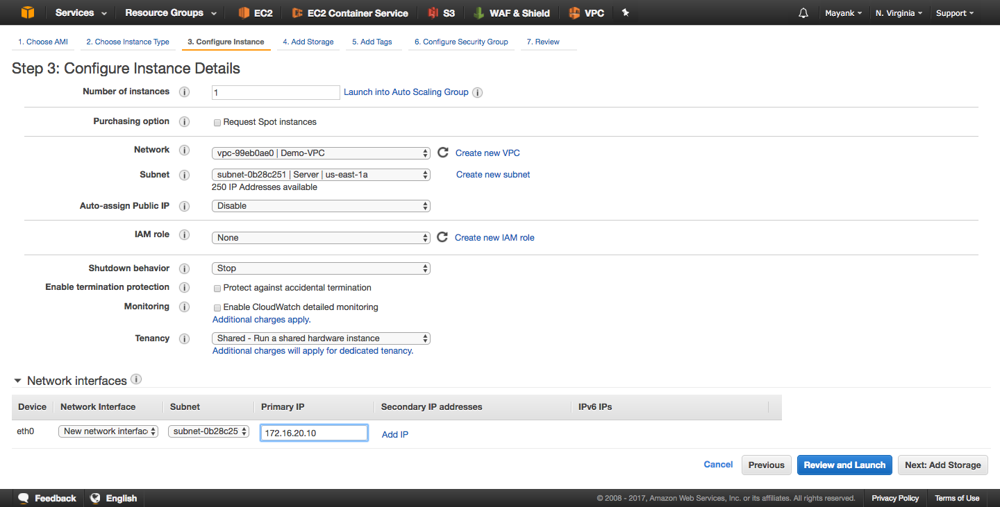

## 4. Next under Add Storage pane, we will associate block volumes to the EC2 Isntances ##

Here we associate block storage to the instances where all filesystem, OS, and persistent data will be stored for the EC2 instance. These volumes are known as [EBS volumes](https://aws.amazon.com/ebs/details/) in AWS. EBS can be elastic in relation to their storage size, IOPs, and Encryption. 
  > Enter 8GB for size and General Purpose for Volume Type for our use case. 
  


## 5. Next under Add Tags we can specify Key Value pairs to reference and index the EC2 instance ##

We won't set any tags here for now.

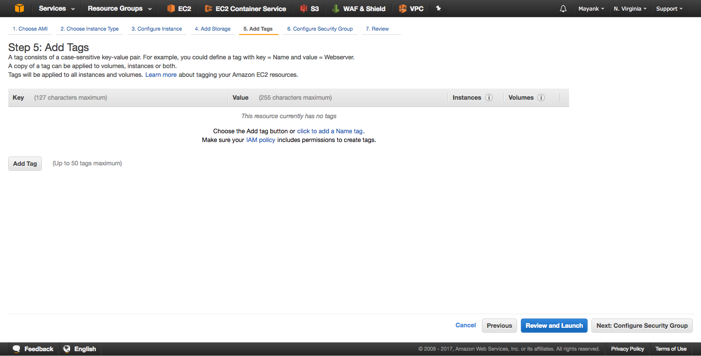

## 6. Configure [Security Groups](http://docs.aws.amazon.com/AWSEC2/latest/UserGuide/using-network-security.html#vpc-security-groups) for firewall rules that control network traffic to your instance. ##

Assign a **new security group** and we will configure rules to allow traffic on port 8080, 8081, 8082 and 22 from any source IP. 
  > **Note** that this does mean ICMP/ping traffic will be blocked along with any other port or protocol to that machine from any other end client within or outside the VPC.
   
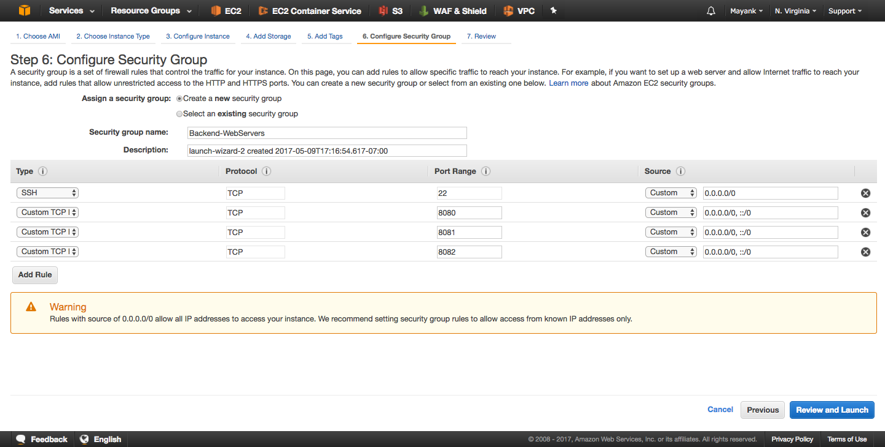

### 7. Review and Launch your configuration ##

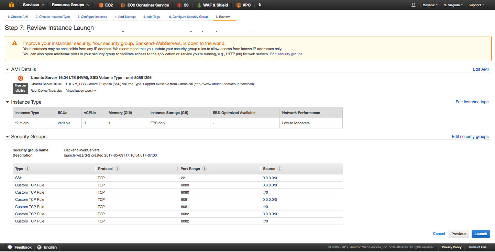

Click Launch to provision your EC2 Instance.

* Once you click Launch you will be asked to create or associate an SSH key pair to the instance. 
* This key pair is crucial and the only way to retrieve your machine's username and password credentials for Windows EC2 instances
* This key pair is also crucial for Linux EC2 instances where this SSH key pair is used to SSH into the machine. 
* Without having the delegated keypair, you may very will be locked out of your instance. 

> Choose the existing key pair : **Demo-Key-Pair** that was created from the [S3 tutorial](../S3/README.md)
  
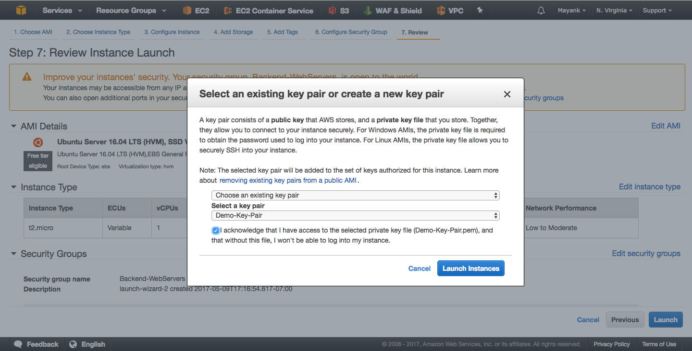

Once provisioned, name the instance under **`EC2 > Instances`** name the new Ubuntu instance `Server-1`

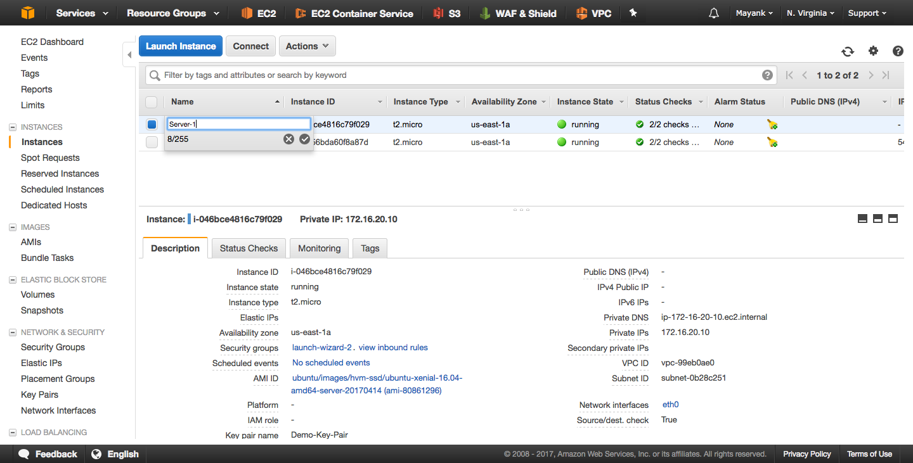

## [Overview EC2 Launch Wizard for Ubuntu Server Instance](#EC2-Ubuntu-Overview) ##

Here is an animation going through the EC2 launch wizard for our use case.


## [SSH into Linux EC2 Instance, Update, and Install Pre-Reqs](#SSH-Linux-EC2) ##

Now that our Linux Instance is up and running, we will now attempt to SSH from our Windows 2016 Server instance. This will be inter-VPC network traffic where the request will originate from our **Client Subnet** that is destined to our **Server Subnet** within our **Demo VPC**

In your windows instance, open up putty and load the saved `Server-1` session we configured earlier and you will be presented with CLI access to the ubuntu machine. 

Lastly, do an update and upgrade on the host to get everything up to latest versions with the following command: 

`sudo apt-get -y update`

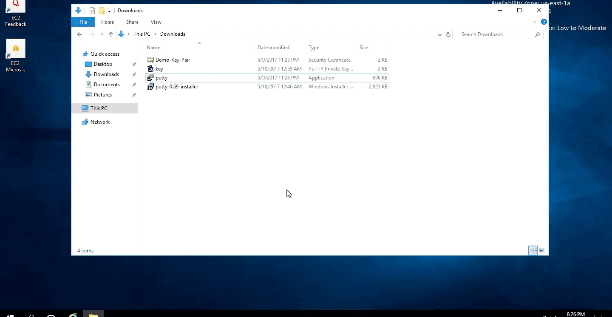

Next install [Docker](https://www.docker.com/what-docker) as a pre-requisite to quickly host web services on the Ubuntu EC2 Instance. Type the following command in CLI.

`sudo apt-get -y install docker.io`


Next we will need to mount the EFS volume we configured earlier in the [EFS Module](../EFS/README.md). Before we can mount it, we need to install NFS client package. Enter the following in the Ubuntu server's CLI: 

`sudo apt-get -y install nfs-common`


# [Mount EFS volumes on the host](#Linux-EFS-Mount) #

In this section we will mount [our Amazon EFS file system](../EFS/README.md) upon boot. To automatically mount our Amazon EFS file system directory when the Amazon EC2 instance reboots, we will make edits to the `fstab` file within the instance. The fstab file contains information about network file systems, and the command `mount -a`, which runs during instance startup and mounts the file systems listed in the fstab file. There are two ways to set up automatic mounting.

## EFS Security Groups ##

First lets make sure our security groups associated with our ENI of the Ubuntu Server allow for NFS traffic and vise versa. We will configure two security groups. **1.** Add a rule to the *Backend-WebServer* to allow NFS traffic from the EFS' ENI. **2.** Then add an inbound rule to the EFS' Security Group to allow NFS traffic from the **Server Subnet**, *172.16.20.0/24*. 

1. Under the [EFS dashboard](https://console.aws.amazon.com/efs/), click on your EFS volume to see details. Note down the Security Group associated with the EFS ENI and then navigate to the [EC2 dashboard](https://console.aws.amazon.com/ec2/) and click on *Security Group* in the left pane. Locate the EFS Security Group (In my case it was `sg-de25efa0`). Add a rule to allow NFS traffic from from the **Server Subnet**, *172.16.20.0/24*. Also, give this security Group a name of `NFS-SG` for easy identification.  


2. Next, still within the the Security Group section, click on the *Backend-WebServer* Security Group and add a rule to allow NFS traffic from the `NFS-SG` wich should show up on the drop down in the text field box by its *Group ID* -- in this case it was sg-de25efa0
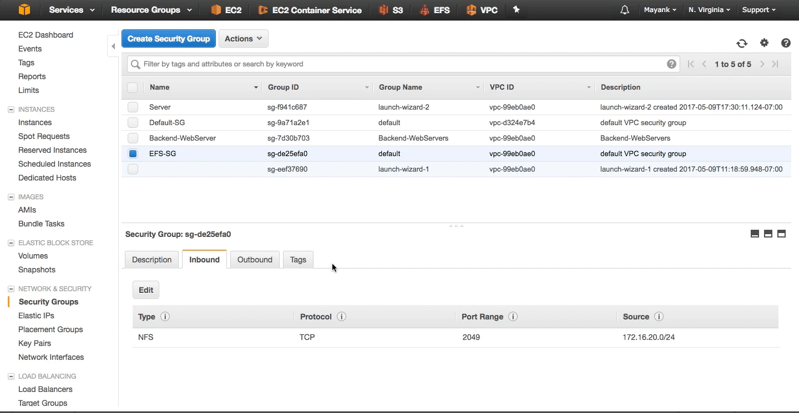

## Mount the EFS ##

Next SSH into the ubuntu machine via the RDP and make a new folder to mount the file system to. 

1. Begin by switching to root user with the following command : `sudo su`. Then Continue by enter the following command to create a new directory: 
`mkdir /data` 

2. Next append the following line to the`/etc/fstab` file  with the following command: 
```bash
sudo echo "172.16.20.208:/ /data nfs4 nfsvers=4.1,rsize=1048576,wsize=1048576,hard,timeo=600,retrans=2 0 0
" >> /etc/fstab
```
> Note that the `172.16.20.208` entry is unique to my use case. It is the DNS name of my EFS that I created. **Yours will be different than shown here.** If you do not remember the IP of your EFS mount point, navigate to the [EFS dashboard](https://console.aws.amazon.com/efs/) and check the details for the **Demo-EFS** EFS volume. 

3. Lastly, re-mount all the volumes in your `fstab` file to see changes by entering the following command: 
`mount -a -t nfs4`

4. Validate your mount point has successfully been created by entering the following command. You should see an output similar to the following: 
`mount | grep /data`

  **Output should look similar to:**
```
172.16.20.208:/ on /data type nfs4 (rw,relatime,vers=4.1,rsize=1048576,wsize=1048576,namlen=255,hard,proto=tcp,timeo00,retrans=2,sec=sys,clientaddr=172.16.20.10,local_lock=none,addr=172.16.20.208)
```

See an overview of steps **2. - 4.** above. 

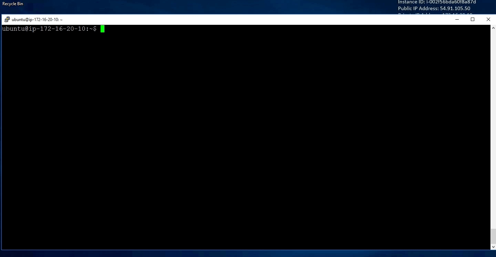

Also, to check the storage available to you on the sharemount, compare the available storage space on your `/` (root) directory and compare it to the space available on the mount point `/data`. Enter the following to see: 

```
cd / 
df -h ./
```

You will see an output showing a total size ~ 8GB total which is the size of your EBS volume attached to your Ubuntu EC2 instance.

```
Filesystem      Size  Used Avail Use% Mounted on
/dev/xvda1      7.7G  1.5G  6.3G  19% /
```

if you type: 

```
cd /data
df -h ./
```
You will see an output showing a total size ~ 8 Exabytes total which is a **lot** of storage that AWS is backing for you, however you are only charged for the number of GB you store in practically an infinitely large EFS storage mount. 

```
Filesystem       Size  Used Avail Use% Mounted on
172.16.20.208:/  8.0E     0  8.0E   0% /data
```

# [Host a File share web Client on port 8080](#Host-file-drop) #

Now that we've got our network storage mount established and all of our pre-requisites complete, we will host a simple *Dropbox* like file sharing webserver that will store data in the EFS volume mount. We will then upload a file or two into the webapp and it will store the files data in the EFS volume mount. 

This exercise will show how applications can store data in EFS mounts attached to EC2 instances.   

## Launch the PSI-Transfer Docker Contianer ##

Begin by assigning the correct permissions to the `/data` directory with the following command: 

`sudo chown -R 1000 /data`

Begin by launching a [*psi-transfer* docker container](https://hub.docker.com/r/psitrax/psitransfer/) that provides a web UI to upload and download files to and from a mapped volume mount. Enter the following command in the SSH session: 

```
sudo docker run -dt -p 8080:3000 --name=drop-share-1 --restart=always -v /data:/data psitrax/psitransfer
```
The breakdown of the command is as follows: 

* The following `docker run` command will run a container in the background with the `-dt` flag.

* The container will be exposed on port `8080` on the Ubuntu host and mapped to port `3000` that is internal to the containers. 

* Name the container `drop-share-1` for easier reference. 

* Always `restart` the container if it goes down or isn't explicitly stopped by the user. 

* In the command we will map a share volume with the `-v` flag where the container can store data in it's `/data` container-local directory that is mapped to the `/data` host-local directory. Basically any data saved in the `/data` directory within the container by the application will be backed on the EFS mount `/data` on the ubuntu host.

* The container will be based on the [`psitrax/psitransfer`](https://hub.docker.com/r/psitrax/psitransfer/) image that is publicly available from [docker hub](https://docs.docker.com/docker-hub/). 

You can check the status of your containers by entering the the `sudo docker ps` command at the cli. 

Overview of the steps above can be seen here: 

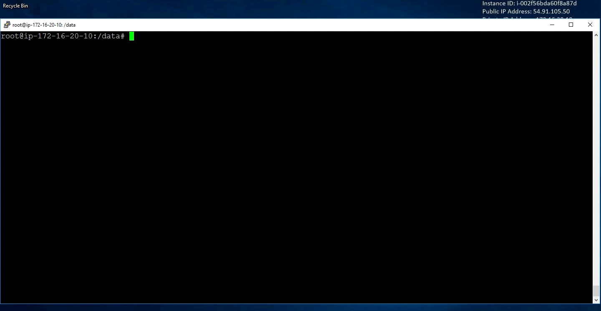

## Access the Web UI and upload a file ##

Now within your windows RDP session, navigate to `http://172.16.20.10:8080` or `http://172.16.20.10:8081`. Once there, upload any file of your choosing, maybe even the `.ppk` file or the `putty.exe`, to upload and see how the application stores data in the `/data` volume mount backed by EFS.

Once you have uploaded your file, ssh into the ubuntu host and check within the `/data` directory to see the files being stored which you uploaded from the Web Browser. 

Enter the following command in the SSH session: 

```
ls -l /data
```

You should see an output similar to the following: 

```
total 4
drwxr-xr-x 2 ubuntu ubuntu 6144 May 12 01:52 12c13ec1e34e

```  
Here is a demonstration of the instructions detailed above: 

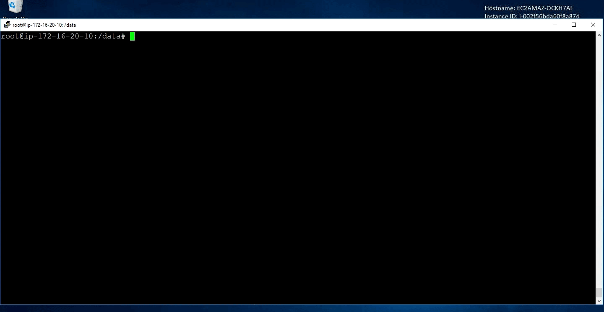

# [Host Webservers A and B on port 9090 and 9091](#Host-Webservers) #

In this section we will simply launch two web sites on the Dockerhost that are labeled as *WebServer-A* and *WebServer-B* to serve as backend services to load balance when we [deploy a NetScaler VPX](../Deploy-NS) for a simple load balancing exercise. 

Ssh into the ubuntu host using putty and issue the following two commands in the CLI: 

```
sudo docker run -dt -p 9090:80 --name=webserver-a --restart=always mayankt/webserver:a
sudo docker run -dt -p 9091:80 --name=webserver-b --restart=always mayankt/webserver:b
sudo docker ps
```

Within your RDP session, navigate to `http://172.16.20.10:9090` and `http://172.16.20.10:9091` to validate the websited are up, running, and available. 

> **NOTE:** Please remember to open ports 9090 and 9091 on your security group associated with the Ubuntu Server's ENI otherwise you will not be able to resolve the websites. *Allow a custom TCP Rule on port 9090 and 9091 from any source IP.*

Here is a demonstration of the instructions detailed above: 


# [Summary](#EC2-Summary) #

In this module we successfully completed the following tasks: 

1. Launched an Ubuntu 16.04 *t2.micro* EC2 Instance on the **Server Subnet**
2. Installed Docker and NFS client utilities as pre-requisits. 
3. Mounted an EFS volume on the EC2 Instance with appropriate Security Group Configurations
4. Launched a file storage Webapp in docker
5. Uploaded files from the Webapp into the EFS backed volume mount in EC2
	
 


