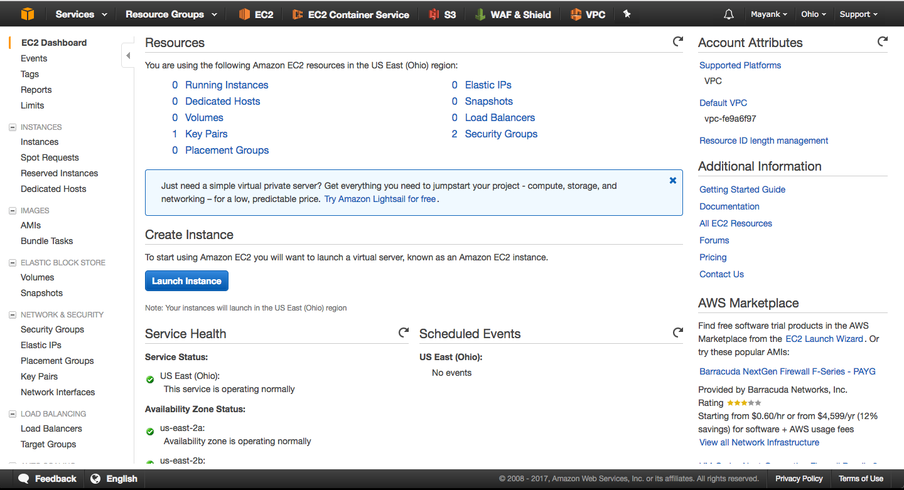
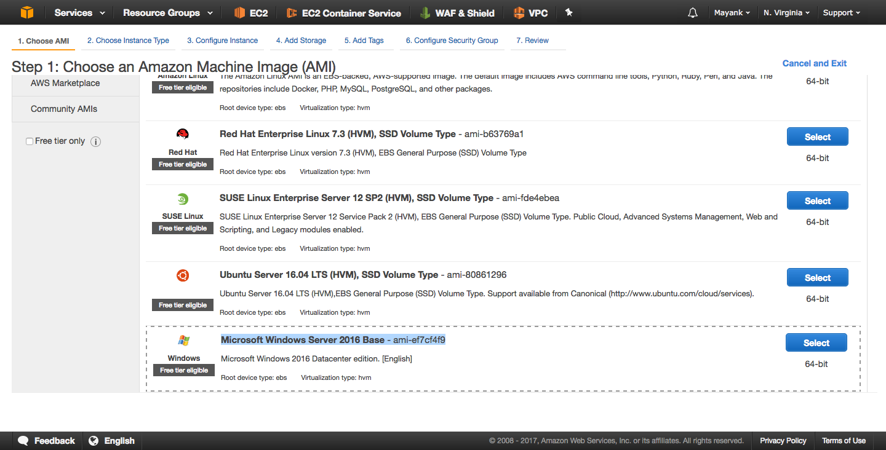
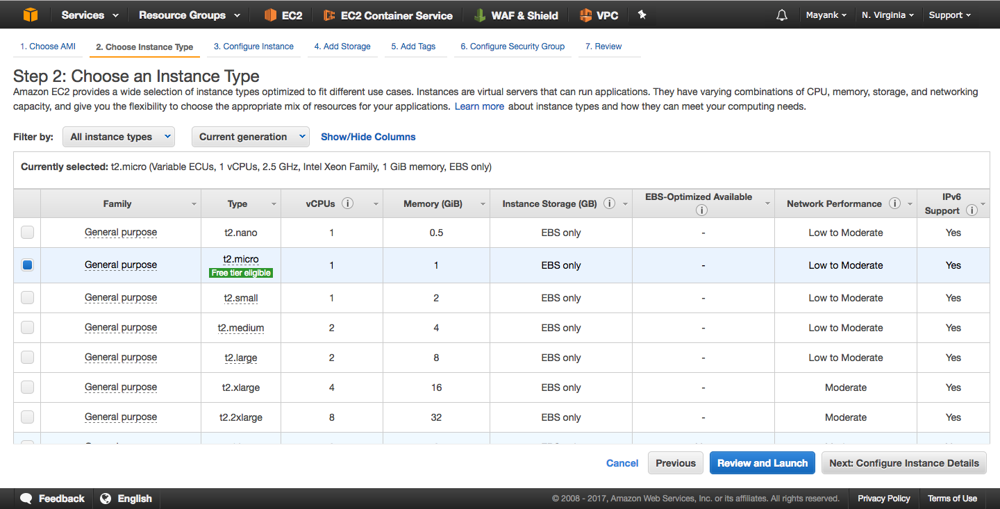
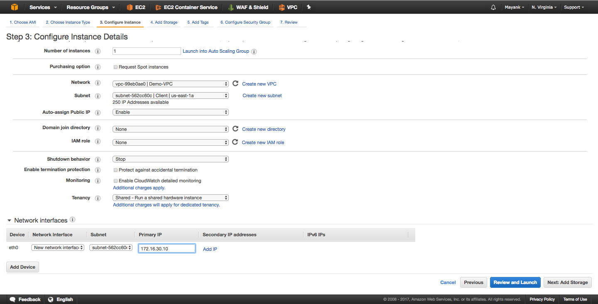
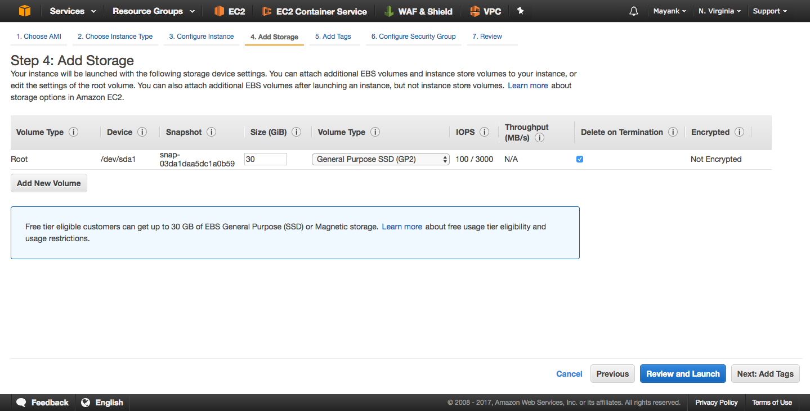
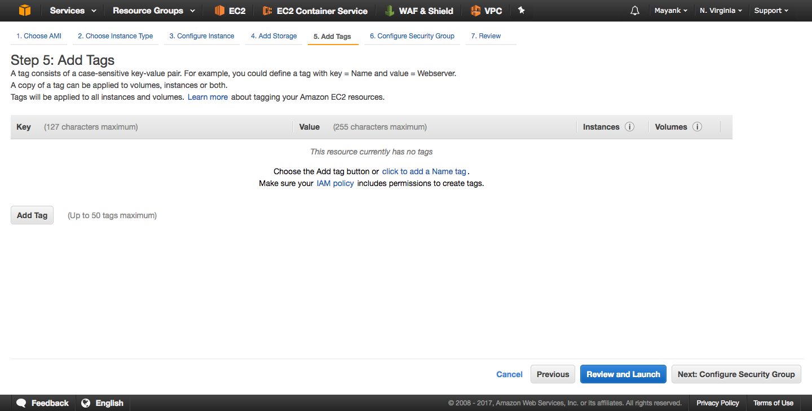
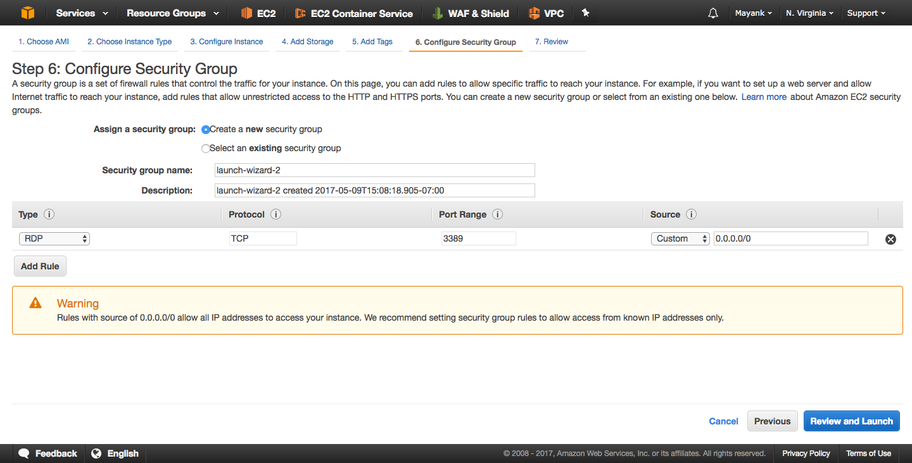
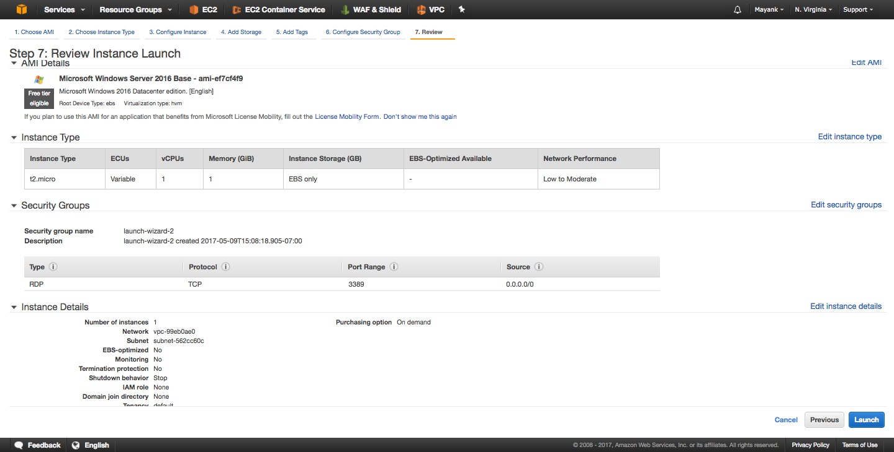
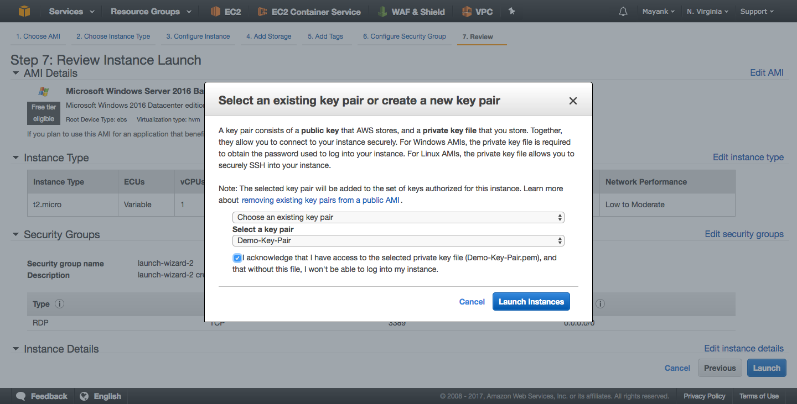

# [Launch a Windows Server 2016 EC2 Instance (Client Network)](#EC2-Windows) #

> It is assumed you have already created an SSH-Key Pair at this point. If you have not, follow instructions in the [s3 tutorial](../S3/ReadMea.md#a-File-S3) "Upload a File to a S3 Bucket"

Begin by clicking on *"Launch Instances"* under *Create Instance* heading within the EC2 Dashboard. Next continue to configure the launch wizard. 

## 1. Select Microsoft Windows Server 2016 Base AMI from AWS Market place under Quick Start ##

  * [AWS Market](https://aws.amazon.com/marketplace/) place holds all publicly available AMI or EC2 templates that you can provision
  * Quick start ones are commonly used AMI's
  * Under **AWS Market Place* you an browse through all the official AMI's available by various Vendors. Here you will find Citrix [NetScaler AMI](https://aws.amazon.com/marketplace/pp/B00AA01BOE?ref=cns_srchrow) as we will see in the next module.
  * You can also browse through community AMI's as well as publish your own AMI's created from EC2 instances into the community store. For [example](https://github.com/cargomedia/vagrant-boxes), this is a Debian based AMI (ami-01220416) for [Vagrant environments](https://www.vagrantup.com/) available in the community store. 

## 2. Next under Instance Type select ***t2.micro*** ** which is [Free Tier Elegible](https://aws.amazon.com/s/dm/optimization/server-side-test/free-tier/free_nc/#details) ##
	* In this step of the Wizard you can select various different resource allocations to your EC2 instance. **Note** that pricing varies based on size of the instance. 

## 3. Next under Configure Instance Details you will specify networking and other configurations ##

* **Number of Instances** will allow you to provision multiple simultaneously.
  > Enter **1** for single instance
  
* **Purchasing option** gives you the opportunity to bid on an instance and provision [spot instances](https://docs.aws.amazon.com/AWSEC2/latest/UserGuide/using-spot-instances.html?icmpid=docs_ec2_console) to reduce compute costs with the trade of flexible around when your applications run and if your applications can be interrupted. 	  
  > Uncheck Spot Instance
  
* **Network** defines which VPC your EC2 will reside in. This binds the EC2 to the networks associated in your virtual private cloud
  > Select the [Demo-VPC](../VPC/README.MD#VPC)** we created in the VPC module.
  
* **Subnet** chooses which network your EC2 will reside in. Here is what determines what IP space the Instance will obtain an IP in as well as the routes it has available to route traffic with the subnet's associated Route Table.
   > Select the **[Client Subnet](../VPC/README.MD#Client-Subnet)** to provision this instance to.
	 
* **Auto-assign Public IP** applicable for public subnets with a default route through the Internet Gateway allows instances to be accessed directly with public IPs which are ephemeral. These public IP's are associated dynamically with the instance only during up time of the instance. These IP's are released into a pool when the instance is turned off and a new one is associated upon reboot. These Public IP's are **NOT** static. 
  > Select Enable so we can later RDP into this VM and access it directly via the public IP. 

* **Domain Join Directory** enables you to join your instance to a directory you've defined in [AWS Directory Service](http://docs.aws.amazon.com/directoryservice/latest/admin-guide/what_is.html) which is similar to Microsoft Active Directory. It gives you a single sign-on and centralized management experience across a network of Windows instances.
  > Select None for our use case

* **IAM Role** as discussed earlier is for [Identity Access Management](https://docs.aws.amazon.com/AWSEC2/latest/UserGuide/iam-roles-for-amazon-ec2.html?icmpid=docs_ec2_console). For EC2, IAM roles automatically deploys and rotates AWS credentials for you, removing the need to store your AWS access keys with your application to make AWS API calls.
  > Select None for our use case

* **Shutdown behavior** specifies upon shutdown of VM, if the instance will be stopped or terminated. 
  > Select Stop** for our use case

* **Enable termination protection** additionally grants additional layer of verification if the instance is going to be terminated. This helps protect against accidental termination. 
  > Uncheck Protect against accidental termination for our use case. 

* **Monitoring** allows AWS to collect logs associated with the instance via [Cloud Watch](https://aws.amazon.com/cloudwatch/details/) to collect and track metrics, collect and monitor log files, set alarms, and automatically react to changes in your AWS instances
  > Uncheck Enable CloudWatch detailed monitoring for our use case.

* **Tenancy** gives you the option to run your instances on physical servers fully dedicated for your use. The use of host tenancy will request to launch instances onto [Dedicated hosts](https://aws.amazon.com/ec2/dedicated-hosts/), while the use of dedicated tenancy will launch instances as [Dedicated instances](https://aws.amazon.com/dedicated-instances/). You can launch an instance with a tenancy of host or dedicated into a Dedicated VPC.
  > Select Shared - Run a shared hardware instance for our use case

* **Network Interfaces** by default create a single vNIC for the instance (eth0). The first and default interface on the instance is it's "default" [Elastic Network Interface (ENI)](http://docs.aws.amazon.com/AWSEC2/latest/UserGuide/using-eni.html). During this step you can specify a static private IP within the subnet or allow an IP to be allocated based on DHCP. 
  > Enter 172.16.30.10 under Primary IP but note you can add additional private IPs that the instance can own associated with a particular ENI. You will also see later when we deploy NetScaler ADC, we will manage ENI private IPs that will be used as VIPs for Load Balancing. 
 

## 4. Next under Add Storage pane, we will associate block volumes to the EC2 Isntances ##

Here we associate block storage to the instances where all file system, OS, and persistent data will be stored for the EC2 instance. These volumes are known as [EBS volumes](https://aws.amazon.com/ebs/details/) in AWS. EBS can be elastic in relation to their storage size, IOPs, and Encryption. 
  > Enter 30GB for size and General Purpose for Volume Type for our use case. 
  

## 5. Next under Add Tags we can specify Key Value pairs to reference and index the EC2 instance ##

We won't set any tags here for now.

## 6. Configure [Security Groups](http://docs.aws.amazon.com/AWSEC2/latest/UserGuide/using-network-security.html#vpc-security-groups) for firewall rules that control network traffic to your instance. ##

Assign a **new security group** and we will stick to the **default values** of only allowing RDP connections from *any* source IP to the instance. 
  > **Note** that this does mean ICMP/ping traffic will be blocked along with any other port or protocol to that machine from any other end client within or outside the VPC.
   

## 7. Review and Launch your configuration ##

Click Launch to provision your EC2 Instance.

* Once you click Launch you will be asked to create or associate an SSH key pair to the instance. 
* This key pair is crucial and the only way to retrieve your machine's username and password credentials for Windows EC2 instances
* This key pair is also crucial for Linux EC2 instances where this SSH key pair is used to SSH into the machine. 
* Without having the delegated keypair, you may very will be locked out of your instance. 

> Choose the existing key pair : **Demo-Key-Pair** that was created from the [S3 tutorial](../S3/README.md)
  

## [Overview EC2 Launch Wizard for Windows Server 2016 Instance](#EC2-Windows-Overview) ##

Here is an animation going through the EC2 launch wizard for our use case. 

## [RDP into Windows EC2 Instance](#Windows-RDP) ##

In this section we will RDP into the Windows EC2 instance we just created. First lets start off by tagging the instance with a name. 

1. Under the EC2 Dashboard, navigate to *Instances* and enter the name `JumpBox`. 

2. Next right click on the instance and select *Get Windows Password*

3. Next click *Choose File* and select your SSH Key Pair : **Demo-Key-Pair** and click Decrypt Password.

4. Once you have your credentials, you can use the provided Public IP, username, and password to RDP into your AWS hosted EC2 Instance in the cloud. Use your favorite [Remote Desktop Client](https://docs.microsoft.com/en-us/windows-server/remote/remote-desktop-services/clients/remote-desktop-clients) to establish your RDP session.

Here is an overview of the process.  

## Upload SSH key into Your Windows Instance

> The pre-requisite for this module is have configured [folder redirection](https://www.google.com/url?sa=t&rct=j&q=&esrc=s&source=web&cd=3&cad=rja&uact=8&ved=0ahUKEwjFrdWaxonVAhUBUGMKHdSSDooQFggxMAI&url=https%3A%2F%2Fsocial.technet.microsoft.com%2FForums%2Fwindows%2Fen-US%2Fa198403a-5f1e-458d-b88f-731bb0ac3e4c%2Ftransfer-files-between-hostclient-computer-with-remote-desktop-v8-on-mac%3Fforum%3DwinRDc&usg=AFQjCNG9P0RRmY8F3SdU5fkO2_KtYNF5JA) in your RDP Session so you can access your SSH key locally stored on your client through Explorer. You are also expected to [download putty](https://the.earth.li/~sgtatham/putty/latest/w32/putty-0.70-installer.msi) and install it locally on your Windows EC2 instance. 

Once you are successfully in your RDP session navigate to your folder redirected directory from your client to copy and paste the SSH key onto your desktop. You need to have the SSH key availible locally in your EC2 machine. 

Next [download and install Putty](https://the.earth.li/~sgtatham/putty/latest/w32/putty-0.70-installer.msi) if you have not already done so. 

Lets now [set up Putty with a pre-set SSH profile](https://www.digitalocean.com/community/tutorials/how-to-use-ssh-keys-with-putty-on-digitalocean-droplets-windows-users) for our future backend Linux Server that will be deployed in the private **Server Subnet**. We will be able to SSH into that Linux instance *only using the SSH key* via our JumpBox instance.

### [Convert your AWS generated private key](http://docs.aws.amazon.com/AWSEC2/latest/UserGuide/putty.html) into .PPK ###

[Convert your AWS generated private key](http://docs.aws.amazon.com/AWSEC2/latest/UserGuide/putty.html) into .PPK is required for Putty to SSH passwordless into a Linux server. If you are on a MAC OSX device, you can SSH into a Linux instance given you have the instance's public IP and the `SSH-Key.pem` file, you can simply enter the following command into Terminal.app : 

`ssh -i /path/to/ssh-key.pem ubuntu@<Public-ip-of-EC2>`

However, for Putty...

1. Lets  begin by first [downloading](https://the.earth.li/~sgtatham/putty/latest/w32/putty-0.69-installer.msi) and installing `PuttyGen` which can convert RSA keys to the required PuTTY format `.ppk`.
2. Once downloaded and installed, run `PuttyGen.exe` from the start menu
3. Click on `Load` and browse to your SSH key pair saved from S3. 
> Remember to select *All Files*  when browsing to detect .pem file extensions.

4. Ensure *Type of key to generate* has *RSA* selected. 
5. Click `Save private key` button and confirm to save in the same `Downloads` directory.

### Create a Putty SSH Profile ###

Next we will configure [Putty with a pre-set SSH profile](https://www.digitalocean.com/community/tutorials/how-to-use-ssh-keys-with-putty-on-digitalocean-droplets-windows-users) for quick SSH access to our Linux EC2 Instance. This is staging a quick access method for subsequent modules and labs. 

1. Next run `Putty.exe` from the start menu.
2. In the left pane under **`Session`**, enter `172.16.20.10` under *hostname* 
3. Keep default port of `22`
4. On the left pane, navigate to **`Connection > SSH > Auth`** and browse to upload your newly converted private `.ppk` key under the *Private key for authentication*
5. Navigate to **`Data`** in the left pane and enter `ubuntu` under *Auto-login username*

  > Ensure that the username "ubuntu" is all lower case as the password is case sensitive.
  
6. Navigate to **`Session`** in the left pane and enter `compute-1` for the *Saved Session* name 
7. Click Save

## Conclusion ##

Now we have Putty set up in our Jumpbox RDP cleint to quickly load the SSH profile for an ubuntu Linux machine with an IP of `172.16.20.10` for remote CLI access. 

Now lets [Ubuntu 16.04 LTS EC2 Instance](../Ubuntu-EC2/README.md#Linux-EC2) onto the private **Server Subnet** with the desired IP.
 

