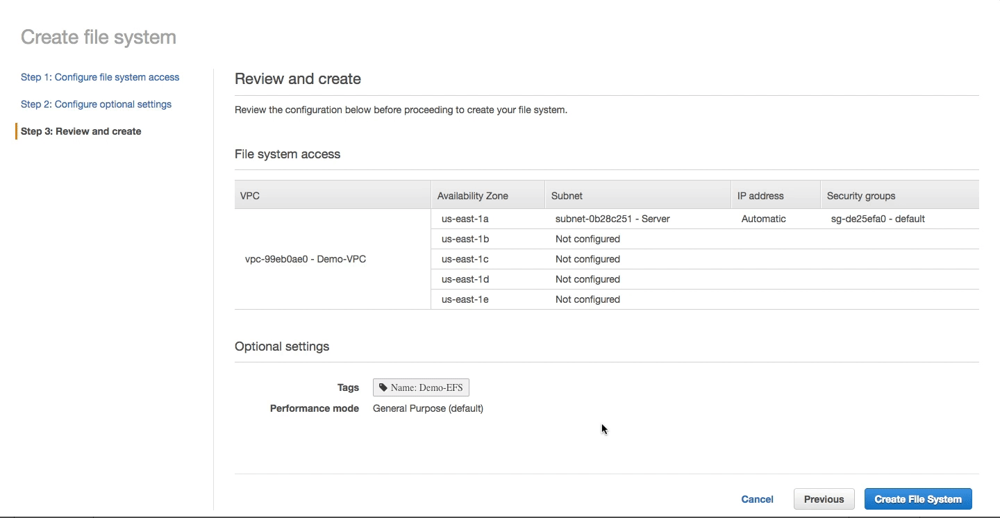

# [Storage in AWS (EFS)](#EFS) #
In this Section we will explore how to Storage compute resources in AWS, particularly with [EFS](http://docs.aws.amazon.com/efs/latest/ug/mounting-fs.html). If you have not already done so, logon to [https://consle.aws.amazon.com](https://consol.aws.amazon.com) to gain access to the AWS dashboard. Once you have logged in, near the top left you will notice a "Service" drop down which lists all of your services availible that you can subscribe to and consume for your cloud infrastructure. For configuring our cloud's computer resources, we will primarily be working in the EFS dashboard. Click on EFS under services to enter the [EFS dashboard](https://console.aws.amazon.com/efs/). 

Once you're in the [EFS dashboard](https://console.aws.amazon.com/efs/), click `Create FileSystem` to begin the EFS wizard. We will provisioned our NFS storage endpoint in our pre-configured `Server Subnet` as discussed in the [VPC tutorial](../VPC/)

##  [Create an EFS Mount Point](#EFS-Wizard) ##

**Step 1: Configure file system access**:

  *  Select our previously created **Demo-VPC**. 
  *  Select the **1a** availiblity zone hosting the **Server Subnet**.
  *  Under IP address, provide `172.16.20.10` IP so we are explicite in your referncing later in the tutorial. 
  * Accept the default selected Security Group. 
    * [Security groups](http://docs.aws.amazon.com/AWSEC2/latest/UserGuide/using-network-security.html) function similarly to ACL firewalls that allow and block access from particular source IP and destination ports. We will further configure this security group later. For now we will accept defaults

***Step 2: Configure optional settings***:

Here we can associate Tags for reference and naming as well as opt in for higher IOPs backed storage for our NFS share. We will name (key) the EFS mount point ***Demo-EFS** (value) and accept the default General Purpose IOP tier.

***Step 3: Review and create***:

Finally confirm the configuration and and click ***Create File System*** button to complete

**It is very important to note down the following information**:

  *  **DNS name**: fs-dd40ff94.efs.us-east-1.amazonaws.com
  *  **Network Interface ID**: eni-27b1eaff
  *  **IP Address:** 172.16.20.247
  *  **Security Groups**: sg-de25efa0 - default

##  [Summary](#EFS-Summary) ##

We have successfully created a NFS mount point to be consumed by our [compute](https://aws.amazon.com/ec2/details/) or [other resources](https://aws.amazon.com/blogs/aws/amazon-efs-update-on-premises-access-via-direct-connect-vpc/) hosted wihtin our VPC.

We will next [configure EC2](../EC2) instances with NFS mount points to use the EFS we configured here and store data. Follow the tutorial on [Compute in AWS (EC2)](../EC2/README.md#Linux-EFS-Mount) to continue. 

